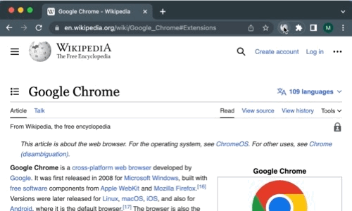

# ChatGPT Chrome Extension: Wikipedia Summary



## Overview

Chrome extension that summarizes Wikipedia article introductions into two short bullet points using ChatGPT

## Technologies

Languages: JavaScript, HTML, CSS

## Dependencies

openai, cors, dotenv, express

## Deployment

### To Get Started:

Clone the repository:

```
git clone https://github.com/matthewcuan/gpt-wiki-summary
```

Change working directry to correct repo:

```
cd gpt-wiki-summary
```

Install dependencies:

```
npm install
```

### To Run:

Configure your environment
- Make a copy of .env.example, and rename it to .env
- Insert your API key

Run server
```
node server.js
```

Load extension into browser

- Navigate to [chrome://extensions/](chrome://extensions/) on a Chrome desktop browser

- Switch to Developer Mode (in top right corner)

- Select "Load Unpacked" (in top left corner) and select "extension" folder within respository (extension)

### To Use:

Pin extension in browser

Navigate to Wikipedia article

Click extension
